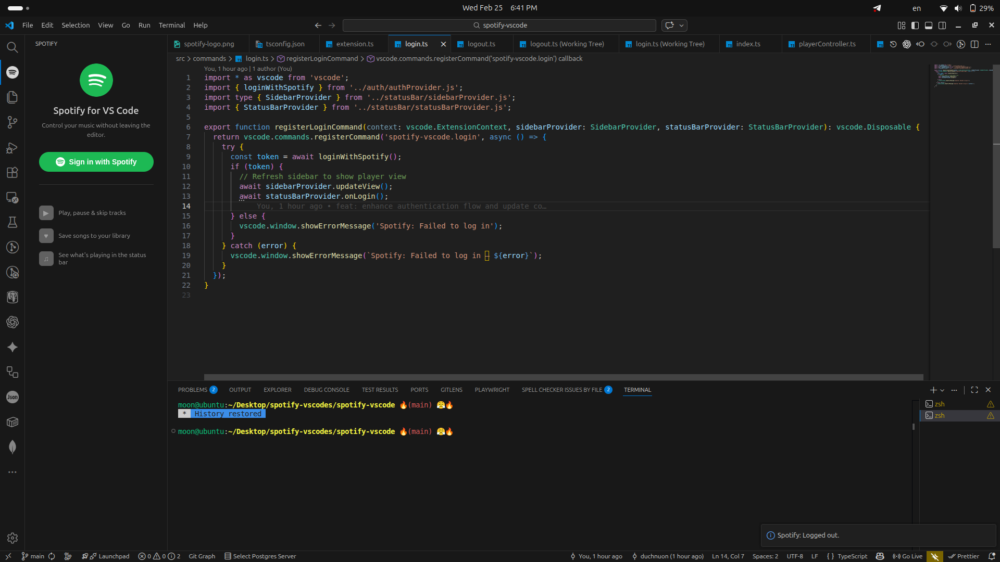
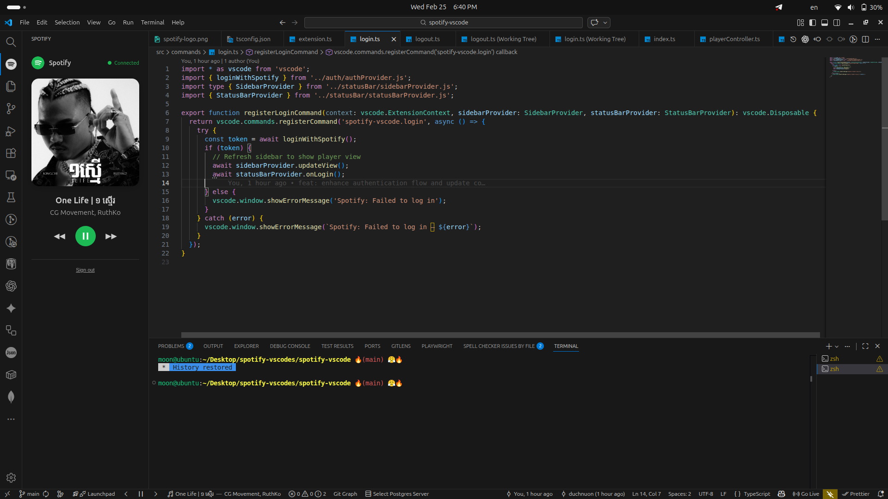

**[Install this extension from the VS Code Marketplace](https://marketplace.visualstudio.com/items?itemName=duch-nuon.spotify-vscode-player)**

# Spotify VS Code Extension

This extension integrates Spotify controls directly into Visual Studio Code, allowing you to manage your music without leaving your editor.

## Features

- **Login/Logout to Spotify** from within VS Code
- **Playback controls**: Play/Pause, Next, Previous, and Favorite tracks
- **Status bar integration**: Control playback from the VS Code status bar
- **Sidebar view**: Access a dedicated Spotify sidebar for controls and information

## Requirements

- **Spotify Premium account is required.**
  - The Spotify Web API only allows playback control for Premium users. Free accounts are not supported for playback features.

## Usage

- Use the Command Palette (`Ctrl+Shift+P` or `Cmd+Shift+P`) and search for Spotify commands (e.g., Login to Spotify, Play, Next Track, etc.)
- Use the Spotify sidebar and status bar controls for quick access.

## Authentication

- On first use, you will be prompted to log in to your Spotify account and grant permissions.
- You can log out at any time using the provided command.

## Using Your Own Spotify Client ID

By default, the extension uses a built-in Spotify Client ID. If you want to use your own Spotify application (for example, to avoid rate limits or for privacy), you can set your own Client ID:

### How to Create a Spotify App and Get Your Client ID

1. Go to the [Spotify Developer Dashboard](https://developer.spotify.com/dashboard/applications).
2. Log in with your Spotify account.
3. Click **Create an App**.
4. Enter an app name and description, then click **Create**.
5. Click on your new app to view its details.
6. Copy the **Client ID** shown on the app page.
7. Click **Edit Settings** and add the following Redirect URI:
  - `http://127.0.0.1:7867/callback`
  (This port, 7867, is used by the extension by default. If you want to use a different port, see below.)
8. Save your changes.

### Setting Your Client ID in the Extension

1. Open the Command Palette (`Ctrl+Shift+P` or `Cmd+Shift+P`).
2. Run the command: **Set Spotify Client ID**.
3. Enter your Spotify application's Client ID and press Enter.
4. The extension will use your Client ID for all future authentication.

You can change or reset this value at any time using the same command.

### Configuring the Redirect Port

By default, the extension uses port `7867` for the authentication callback. If you want to use a different port:

1. In your Spotify app settings, add a new Redirect URI with your desired port, e.g. `http://127.0.0.1:PORT/callback`.
2. In VS Code, open **Settings** (`Ctrl+,` or `Cmd+,`).
3. Search for `spotify.redirectPort` (if available) or update the extension's configuration to match your chosen port.
4. Make sure the port you choose is not blocked or in use by another application.

**Note:** If you change the port, you must update both the Spotify app Redirect URI and the extension settings to match.

## Disclaimer

This extension is not affiliated with or endorsed by Spotify AB. All Spotify trademarks, logos, and brand names are the property of Spotify AB.
